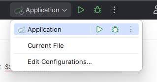
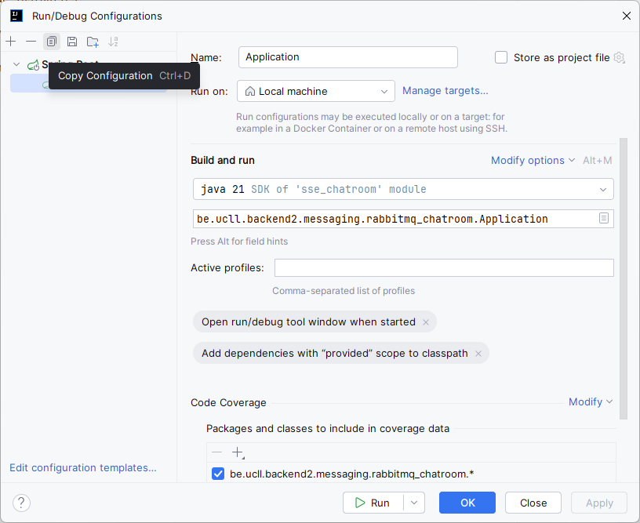
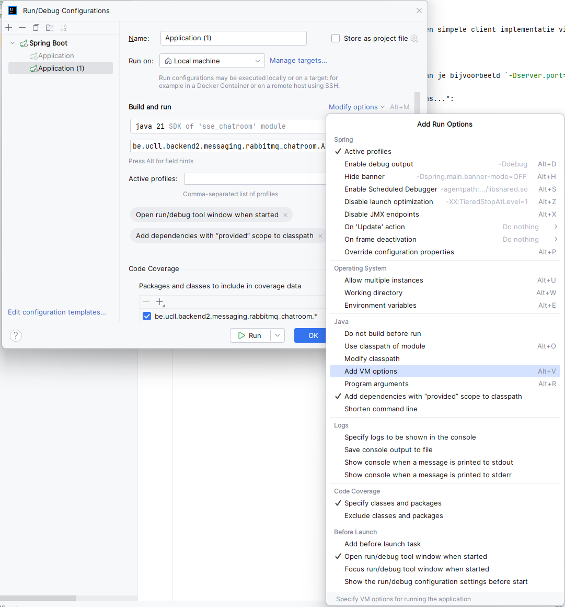
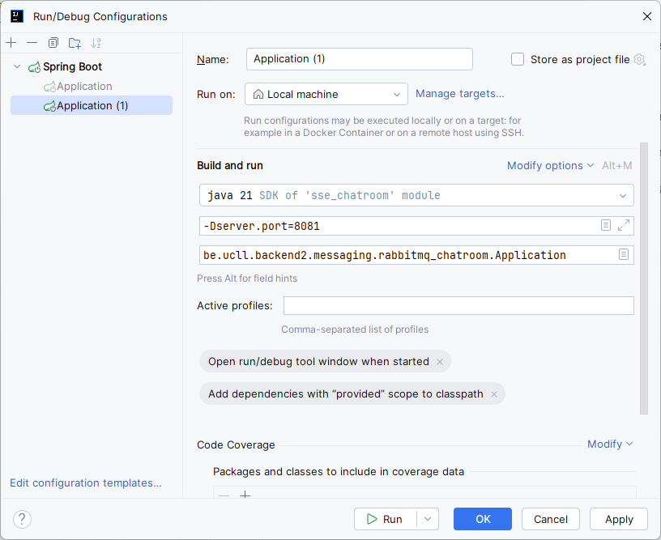

# RabbitMQ Chatroom

Dit voorbeeld combineert het fanout exchange RabbitMQ voorbeeld met het SSE chatroom voorbeeld.

Je kan nu meerde instanties opstarten van dezelfde applicatie (op een andere poort). Zolang
deze verbonden zijn met dezelfde RabbitMQ instantie en PostgreSQL database zal je berichten
kunnen sturen tussen deze verschillende instanties.

Op http://localhost:8080 (of een ander poortnummer) zal je een simpele client implementatie vinden ter demonstratie.

## Andere poort instellen met IntelliJ

Als je een tweede instantie wil runnen op een andere poort kan je bijvoorbeeld `-Dserver.port=8081` meegeven aan Java.

Klik bovenaan op de "Application" en kies "Edit Configurations...":

Kopieer de bestaande configuratie:

Kies onder "Modify options" "Add VM Options":

Stel met `-D` properties in (zoals `server.port`):

Je kan nu deze tweede instantie tegelijk met de eerste runnen en
bereiken via http://localhost:8081. Je zal zien dat messages
doorgegeven worden tussen instanties.